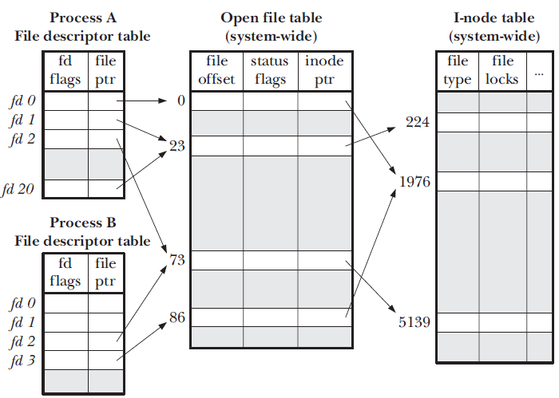

> 计算机最伟大的思想之一--- 抽象
>
> * 文件系统和文件
> * 文件描述符
> * 目录
> * 文件别名
> * 文件系统种类

# 文件系统和文件

1. 文件系统：一种用于持久性存储的系统抽象。

> 在存储器上：组织、控制、导航、访问和检索数据

2. 文件：文件系统中一个单元的相关数据在操作系统中的抽象。

**文件系统的功能：**

* 分配文件磁盘空间
  * 管理文件块（哪一块属于哪一个文件）
  * 管理空闲空间（哪一块是空闲的）
  * 分配算法（策略）
* 管理文件集合
  * 定位文件及其内容
  * 命名：通过名字找到文件的接口
  * 最常见：分层文件系统
  * 文件系统类型（组织文件的不同方式）
* 提供的便利及特性
  * 保护：分层来保护数据安全
  * 可靠性/持久性：保持文件的持久

**文件**

文件系统中一个单元相关存储内容的抽象

* 文件属性

> 名称、类型、位置、大小、保护、创建者、创建时间、最近修改时间、文件头

* 文件头

  * 在存储元数据中保存了每个文件的信息

  * 保存文件的属性

  * 跟踪哪一块存储块属于逻辑上文件结构的哪个偏移   

# 文件描述符

> 文件描述符的使用者是程序

* 文件使用模式

```c
f = open(name, flag);
...
... = read(f, ...);
...
close(f)
```

* 内核跟踪每个进程打开的文件
  * 操作系统为**每个进程**维护一个打开文件表
  * 一个打开文件描述符是这个表中的**索引**



> 1. 用户（程序）视图
>
>    持久的**数据结构**
>
> 2. 系统的访问接口
>
>    **字节的集合**，操作系统不会关心你想存储在磁盘上的任何数据结构
>
> 3. 操作系统内部视角
>
>    块的集合（块是文件系统提供的逻辑抽象单元，扇区时物理单元）

* 操作系统需要元数据来管理打开的文件

> 1. 文件指针：
>    指向最近的一次读写位置，每个打开了这个文件的进程都指向这个指针。
> 2. 文件打开计数
>    记录文件打开的次数，允许多个进程打开同一个文件。当最后一个进程关闭了文件时，允许将其从打开的文件表中移除。
> 3. 文件磁盘位置
>    缓存数据访问信息
> 4. 访问权限
>    每个程序访问模式信息

# 目录

* 文件以目录的方式组织起来

* 目录时一种的特殊的文件

  * 每个目录包含了一张表

    <name, poinrer to file header>

    * 线性列表
    * Hash表

* 目录和文件的树形结构，层次命名空间，路径的访问和遍历

**典型操作**

> 1. 搜索文件
> 2. 创建文件
> 3. 删除文件
> 4. 枚举目录
> 5. 重命名文件
> 6. 在文件系统中遍历一个路径

> 操作系统只允许内核模式修改目录
>
> * 确保映射的完整性


