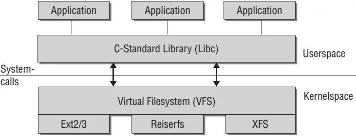

分层结构

* 上层：虚拟文件系统
* 底层：特定文件系统模块

组成：

* 卷控制块（Unix，superblock）
  * 每个文件系统一个
  * 文件系统详细信息
  * 块、块大小、空余块，计数/指针等
* 文件控制块（Unix: vnode inode）
  * 每个文件一个
  * 文件详细信息
  * 许可、拥有者、大小、数据库位置等
* 目录节点（linux：dentry）
  * 每个目录项一个
  * 将目录项数据结构及树形布局编码成树形数据结构
  * 指向文件控制块、父节点、项目列表等

